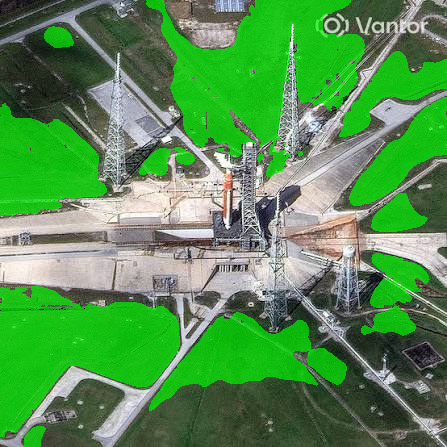
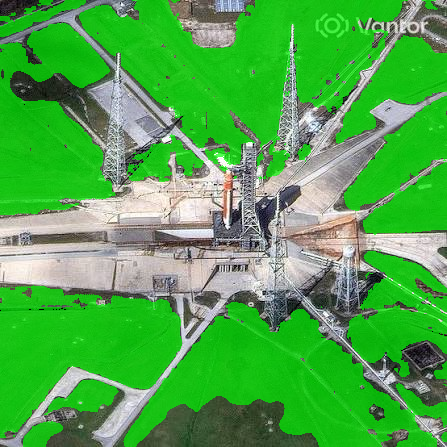
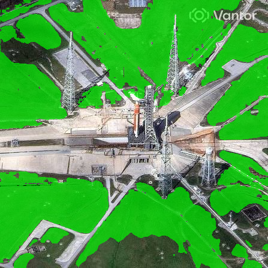

# Ottermap Turf/Grass Detection — 72-Hour Challenge Submission

## Project Summary
**End-to-end pipeline:** Aerial GeoTIFF + verified GeoJSON turf labels → rasterized masks → rectangular tiling → fine-tuned hypersensitive U-Net + Zero-Shot SAM Ensemble → GIS-compatible vector output.

Because the provided dataset consisted of 3 massive images with verified GeoJSON turf polygons, the pipeline was able to rasterize the polygons directly into training masks. Given the small number of source scenes, the primary risk was the neural network memorizing specific color palettes rather than learning what grass actually is. 

Here is the complete story of how we engineered the final turf segmentation pipeline to solve this exact problem—an iterative, real-world journey from standard deep learning to a highly robust ensemble architecture.

---

## Setup & Quickstart

```bash
# Setup Environment
python -m venv venv && source venv/bin/activate
pip install -r requirements.txt
```

### The Final Production Pipeline (Inference)
Because standalone models can struggle to generalize perfectly to vastly different lighting/domains, the final production pipeline relies on a triple-intersection ensemble:
1. **Hypersensitive U-Net**: Runs at a highly permissive `0.1` threshold to maximize recall.
2. **SAM Geometry**: Zero-shot Grounding DINO + SAM provides perfect geometric boundaries.
3. **ExG Color Filter**: An Excess Green index filter acts as a strict gatekeeper to strip out any gray pavement.

We have bundled this entire 4-step process (SAM → U-Net → Ensemble Intersection → GIS Vectorization) into a single command:

```bash
python src/run_pipeline.py --image path/to/unseen_image.tif
```
This will automatically generate the intermediate masks and output the final ensemble mask and the vectorized `.geojson` file into `results/pipeline_output`.

---

## Phase 1: The Vanilla U-Net (Expectation vs. Reality)

We started with a standard supervised deep learning approach. Given 3 massive aerial GeoTIFFs with perfectly verified GeoJSON turf labels, we sliced them into 256x512 tiles, creating a dataset of about 240 training samples. 

We fine-tuned a U-Net (with a ResNet34 encoder) using a combination of Dice and BCE loss. Because we only had 3 source images, the biggest risk was the model memorizing the specific lighting and color palette of those three days. To combat this, we kept the encoder mostly frozen during warmup, used a lower learning rate, and hammered the data with heavy color/brightness jittering augmentations rather than geometric ones.

**The Results:**
On paper, it looked fantastic. The model achieved a **Validation mIoU of 87.45%**. On the training/validation domains, it predicted turf with razor-sharp precision:

> **Training Domain Performance:** The U-Net perfectly identifying grass on the original dataset domain.
> 

**The Reality Check:**
Then we threw it at completely unseen test images downloaded from different domains. It immediately fell apart. Because it had overfit to the *spectral signatures* (the specific shades of green and brown) of the training set, it either hallucinated grass on gray pavements or completely missed obvious lawns in new lighting conditions. 

> **Test Domain Failure:** The standard U-Net (0.5 threshold) on `test5.jpeg` predicting only 4.63% coverage and missing massive chunks of obvious grass.
> 

---

## Phase 2: Enter Zero-Shot SAM

Since the U-Net failed to generalize its spectral understanding, we pivoted. What if we ignored color and focused entirely on *geometry*?

We built a zero-shot pipeline using **Grounding DINO** (to find bounding boxes matching the text prompt "turf, grass, lawn") and passed those boxes into **Segment Anything (SAM)**. 

**What we found:**
SAM completely solved the problem the U-Net had. While the U-Net missed obvious grass because the color was slightly off, SAM didn't care about color at all—it locked onto the crisp, physical geometric boundaries of the lawns flawlessly. It found all the grass that the U-Net missed.

> **Where SAM Won:** On `test3.jpg`, the lighting is extremely dark. The standalone U-Net completely failed (predicting 0.00% coverage even at permissive thresholds). SAM, relying purely on geometry, easily found the lawns.
> 

But SAM had its own fatal flaw: it has no idea what grass actually *is*. If Grounding DINO drew a bounding box that slightly overlapped a driveway, SAM would confidently segment the entire driveway along with the lawn because they shared a continuous geometric boundary. 

> **Where SAM Failed (Leakage):** SAM on `test5.jpeg`. It captures the grass beautifully (which the U-Net failed to do!), but aggressively leaks out into the surrounding non-turf terrain (the driveway and road). 
> 

We had two fundamentally different models that acted as a perfect **Yin and Yang**:
- The U-Net was great at knowing *what color grass is*, but terrible at finding its boundaries in new lighting.
- SAM was incredible at finding *perfect geometric boundaries*, but terrible at knowing what to draw them around.

---

## Phase 3: The Hypersensitive Ensemble (The Final Boss)

We realized the solution wasn't to pick one model, but to pit them against each other in a strict **Logical AND** gate. 

Here is how the final architecture works:

1. **The Hypersensitive U-Net:** We run the U-Net at a ridiculously low, highly permissive threshold of **`0.1`** (instead of the standard `0.5`). This forces the U-Net to highlight *anything* that could even remotely be grass, guaranteeing extremely high recall.
2. **The Geometric SAM:** We run the Grounding DINO + SAM pipeline to get the exact physical shapes of the lawns.
3. **The Intersection:** We mathematically intersect the two masks. The U-Net acts as a "spectral filter" cutting out SAM's pavement leaks, while SAM acts as a "geometric filter" cleaning up the U-Net's fuzzy, hallucinated blobs.
4. **The ExG Sanity Filter:** As the ultimate failsafe against gray roads slipping through, we apply an Excess Green Index filter (`2G - R - B > 10`). This mechanically strips out any gray/concrete pixels that the neural networks might have erroneously agreed on.

**The Final Result:**
The ensemble approach perfectly isolates the turf, snapping to exact boundaries while rejecting the false positives that plagued both standalone models.

> **Final Ensemble Success (Unseen Test Domain):** The triple-intersection pipeline on `test5.jpeg`. Perfect boundaries, high recall, and zero pavement leakage.
> 

> **Final Ensemble Success (Original Training Domain):** The pipeline also performs flawlessly on the original training images, confirming that the strict SAM geometry filter does not harm performance where the standalone U-Net already succeeded.
> 

---

## Phase 4: Dialing in the Hypersensitive Threshold

Once we settled on the triple-intersection ensemble architecture, we had to determine exactly how "hypersensitive" the U-Net needed to be. If the threshold was too high, we would lose recall; if it was too low, the noise would overwhelm the geometric filters.

We ran a threshold sweep across the dataset. Here is how the ensemble behaved on `test8.jpeg` at different U-Net confidence thresholds:

> **Threshold 0.50 (Standard):** Highly conservative. The U-Net drops significant portions of valid grass before it even reaches the SAM intersection step, resulting in a fragmented, incomplete lawn.
> 

> **Threshold 0.05 (Ultra-Permissive):** Captures all the grass, but borders on being too messy. While the ExG filter and SAM boundaries catch almost all false positives, pushing the U-Net this low introduces slight raggedness to the mask edges.
> 

> **Threshold 0.10 (The Sweet Spot):** This is the finalized threshold. It maximizes recall across unseen domains without becoming overwhelmingly noisy, allowing SAM and the ExG filter to effortlessly carve out the perfect geometric boundaries.
> 

### Why this is the winner
This approach is virtually bulletproof against domain shifts. By decoupling the problem into three distinct failure domains (Spectral/Color via U-Net, Geometry/Shape via SAM, and Mechanical/Sanity via ExG), a pixel must literally fool all three independent systems simultaneously to be incorrectly classified as turf.

---

## Repo Structure

```text
src/
  geoutils.py       # georeferencing helpers (rasterio-based, with a cv2/tifffile fallback)
  tiling.py         # large GeoTIFF -> training tiles, spatial train/val split
  dataset.py        # PyTorch Dataset + augmentation (color/lighting-heavy)
  train.py          # U-Net training loop (staged encoder unfreezing)
  inference.py      # sliding-window inference on full-size unseen imagery
  vectorize.py      # raster mask -> GeoJSON / Shapefile
  zero_shot_sam.py  # Grounding-DINO + SAM pipeline
  ensemble.py       # Hypersensitive Ensemble + ExG intersection logic
data/raw/           # provided tif + geojson pairs
data/tiles/         # generated training tiles + manifest
weights/            # trained checkpoints
results/            # prediction visualizations (train/val/external)
outputs_gis/        # sample GeoJSON / Shapefile outputs
```
